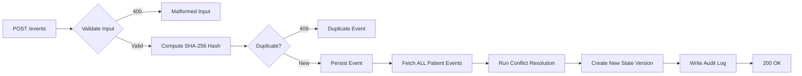
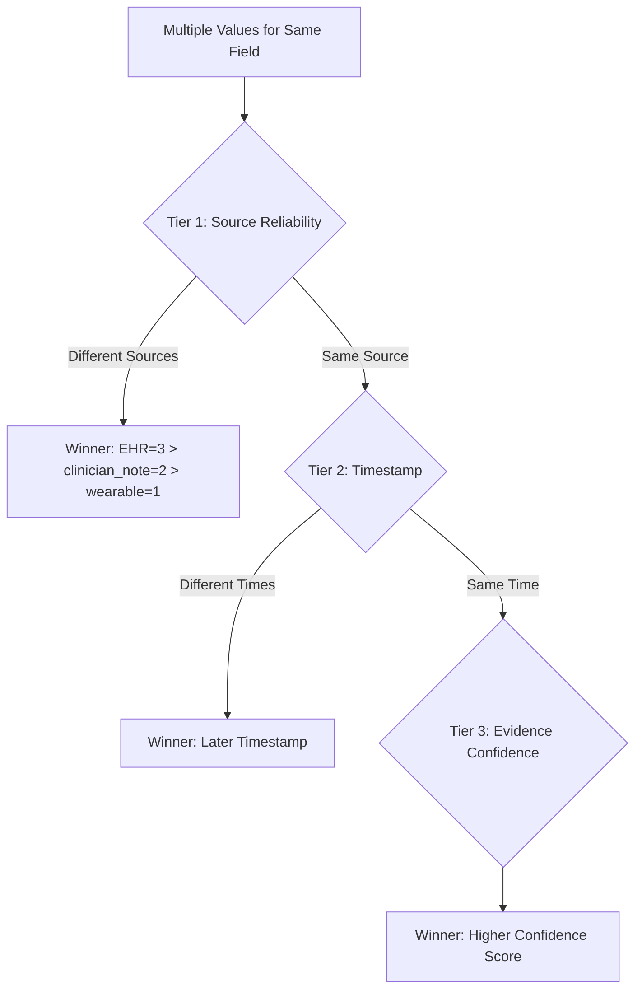
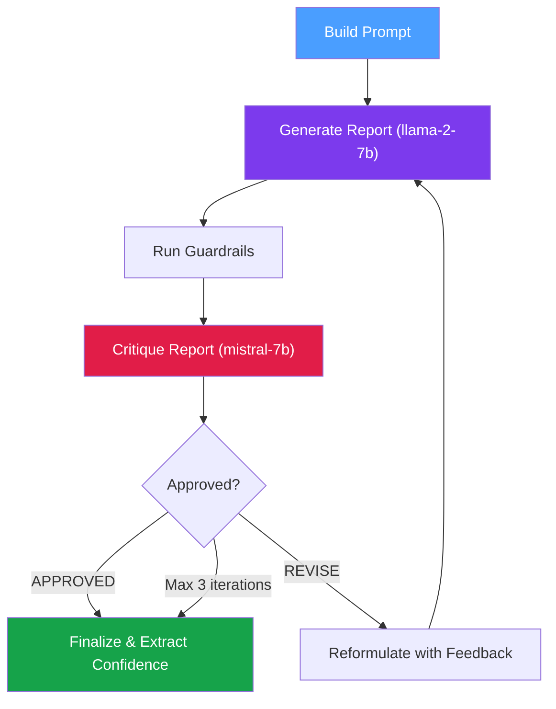
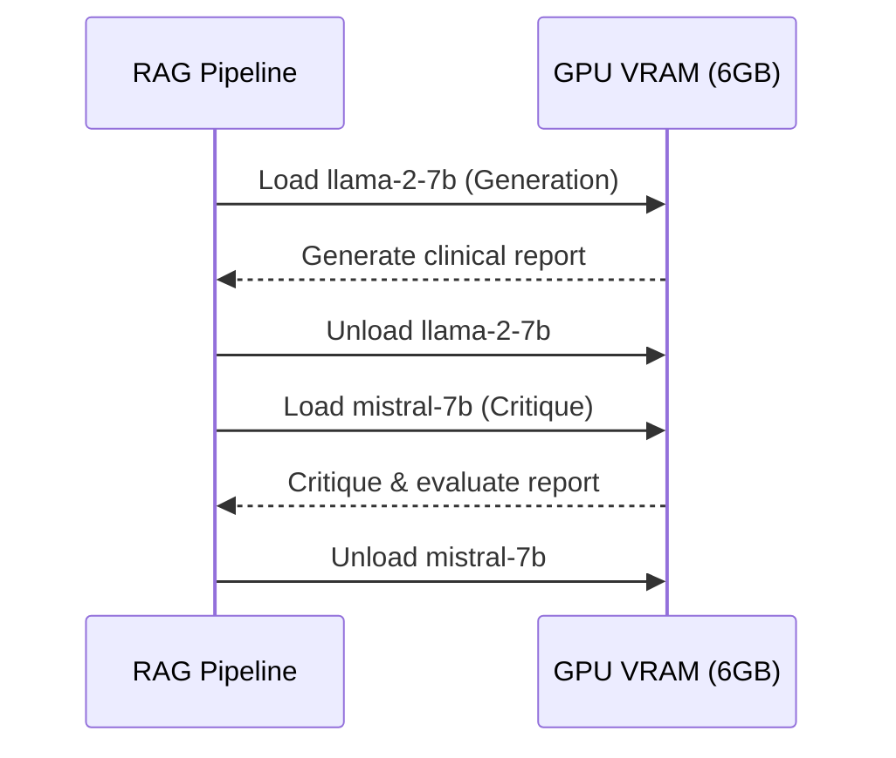

# 🏥 Stateful LLM Clinical Report Generator


A reconciliation-driven, stateful AI clinical report generator built with **FastAPI**, **LangGraph**, **Streamlit**, and **Local GGUF Models**.

This system processes incoming clinical events (EHR, wearables, clinician notes), maintains a versioned patient state in SQLite, resolves data conflicts deterministically, and generates clinical reports using an advanced self-critique loop with local Large Language Models.

---

## ✨ Key Features

| Feature | Description |
|---|---|
| **Idempotent Event Ingestion** | `POST /events` safely handles duplicates and out-of-order events using SHA-256 payload hashing. Returns `200`, `400`, or `409`. |
| **Deterministic Conflict Resolution** | Strict 3-tier ranking hierarchy: `Source Reliability` > `Timestamp` > `Evidence Confidence`. No ML involved. |
| **Stateful RAG Pipeline** | LangGraph-powered self-critique loop using `llama-2-7b` (generation) and `mistral-7b` (critique). |
| **Resource Optimized** | Sequential model loading/unloading to fit within 6GB VRAM. Graceful mock fallback when models are unavailable. |
| **Comprehensive Provenance** | Append-only audit trail tracking every ingestion, conflict resolution decision, and report generation. |
| **Replayability** | `GET /replay/{patient_id}` re-derives state from raw events and verifies determinism. |
| **Guardrails** | PII detection (SSN, email, phone, credit card) and prompt injection filtering on both input and output. |

---

## 📁 Project Structure

```
Assessment/
├── backend/
│   ├── app/
│   │   ├── __init__.py
│   │   ├── main.py                  # FastAPI entry point, CORS, lifespan
│   │   ├── config.py                # All settings: DB path, model paths, LLM params
│   │   ├── database.py              # SQLAlchemy engine, session factory, init_db()
│   │   ├── db_models.py             # ORM models: Event, PatientState, AuditLog, Report
│   │   ├── schemas.py               # Pydantic request/response schemas
│   │   ├── routers/
│   │   │   ├── events.py            # POST /events — ingestion, dedup, state update
│   │   │   ├── reports.py           # POST/GET /report/{id} — RAG pipeline trigger
│   │   │   └── audit.py             # GET /audit/{id}, /state/{id}, /replay/{id}
│   │   ├── services/
│   │   │   ├── deduplication.py      # SHA-256 hash-based duplicate check
│   │   │   ├── conflict_resolver.py  # 3-tier deterministic conflict resolution
│   │   │   ├── state_manager.py      # Versioned patient state management
│   │   │   ├── rag_pipeline.py       # LangGraph self-critique pipeline
│   │   │   ├── llm_manager.py        # Sequential GGUF model loader (mock fallback)
│   │   │   └── guardrails.py         # PII detection, prompt injection, output validation
│   │   └── utils/
│   │       └── hashing.py            # Deterministic SHA-256 event hashing
│   ├── data/
│   │   ├── sample_events.json        # ← Fixture data (≥5 edge cases)
│   │   └── clinical.db               # ← SQLite database (auto-created)
│   ├── models/                        # ← Place GGUF model files here
│   │   └── .gitkeep
│   ├── tests/
│   │   ├── conftest.py               # In-memory SQLite test fixtures
│   │   ├── test_api.py               # API integration tests (5 edge cases)
│   │   └── test_conflict.py          # Unit tests for conflict resolution
│   ├── requirements.txt
│   └── Dockerfile
├── frontend/
│   ├── app.py                         # Streamlit clinical dashboard
│   ├── requirements.txt
│   └── Dockerfile
├── docker-compose.yml
├── prd.md                             # Product Requirements Document
├── README.md                          # ← You are here
└── .gitignore
```

---

## 🔄 System Architecture & Workflow

### Event Ingestion Flow



### Conflict Resolution Strategy



### RAG Pipeline (Self-Critique Loop)



### Sequential LLM Loading (Memory Management)



---

## 🚀 Getting Started

### 1. Clone

```bash
git clone https://github.com/PesHwA07/Assessment-Ascend.git
cd Assessment
```

### 2. Setup

The system is built to use self-hosted GGUF models. To run the real LLMs, download and place your GGUF files directly into the `backend/models/` directory:

| Model | File | Role |
|---|---|---|
| LLaMA 2 7B Chat | `llama-2-7b-chat.Q4_K_M.gguf` | Report generation |
| Mistral 7B Instruct | `mistral-7b-instruct-v0.2.Q4_K_M.gguf` | Self-critique |

> **Mock Mode**: If you do not install `llama-cpp-python` or download the models, the system will automatically and gracefully fall back to **Mock Mode**. This allows you to test the entire architecture, UI, and API without needing a high-end GPU.

### 3. Run

**Option A — Docker Compose (Recommended)**

```bash
docker-compose up --build
```

**Option B — Local Development**

```bash
# Backend
cd backend
python -m venv venv
venv\Scripts\activate        # Windows
pip install -r requirements.txt
uvicorn app.main:app --host 127.0.0.1 --port 8000

# Frontend (separate terminal)
cd frontend
python -m venv venv
venv\Scripts\activate
pip install -r requirements.txt
streamlit run app.py
```

Once running, access:

| Service | URL |
|---|---|
| **Clinical Dashboard** | [http://localhost:8501](http://localhost:8501) |
| **Backend API** | [http://localhost:8000](http://localhost:8000) |
| **Swagger Docs** | [http://localhost:8000/docs](http://localhost:8000/docs) |

### 4. Test

The test suite covers all 5 PRD-mandated edge cases:

| Test | File | What it verifies |
|---|---|---|
| Duplicate events | `test_api.py` | Same event twice → 409, state unchanged |
| Late/out-of-order events | `test_api.py` | State correctly rebuilt regardless of arrival order |
| Conflicting data | `test_api.py`, `test_conflict.py` | EHR wins over clinician_note via source reliability |
| Missing/malformed events | `test_api.py` | Missing fields → 400 Bad Request |
| Replay determinism | `test_api.py` | `/replay` re-derives identical state |

```bash
cd backend
pip install -r requirements.txt
pytest tests/ -v
```

---

## 📁 Fixtures & Audit Outputs

### Where do Fixtures live?

**`backend/data/sample_events.json`** — Contains 8 events across 3 patients covering duplicates, conflicts, out-of-order arrivals, and multi-source data.

You can also inject events through the Streamlit sidebar form or via the API directly.

### Where do Audit Outputs live?

Audit logs are stored in the `audit_logs` table of `backend/data/clinical.db` (SQLite).

| Access Method | How |
|---|---|
| **API** | `GET /audit/{patient_id}` |
| **Dashboard** | "Data Provenance & Conflicts" tab in Streamlit |
| **Direct SQL** | `sqlite3 backend/data/clinical.db "SELECT * FROM audit_logs;"` |

---

## 🧠 Key Design Decisions

1. **Streamlit over React**: The PRD mentions "React dashboard" (line 68) but also mandates "Use only Python" (line 57). Since these constraints conflict, we chose **Streamlit** — a Python-native dashboard framework — to keep the entire codebase in a single language and simplify deployment. The dashboard delivers the same functionality: patient state visualization, audit log browsing, and report generation.

2. **Deterministic Conflict Resolution (No ML)**: Per the PRD, we use hard-coded 3-tier rules (`Source > Timestamp > Confidence`) rather than an LLM, ensuring reproducibility and auditability.

3. **Sequential LLM Loading**: Due to VRAM constraints (6GB), `LLMManager` loads/unloads one model at a time — generation first, then critique — preventing OOM errors on consumer-grade GPUs.

4. **Mock Mode Fallback**: If `llama-cpp-python` is not installed or GGUF model files are absent, the system gracefully falls back to deterministic mock responses, allowing the full architecture to be tested without a GPU.

---

## 🛡️ API Reference

| Method | Endpoint | Description | Status Codes |
|---|---|---|---|
| `POST` | `/events` | Ingest a clinical event | `200`, `400`, `409` |
| `GET` | `/state/{patient_id}` | Get current patient state | `200`, `404` |
| `POST` | `/report/{patient_id}` | Trigger RAG pipeline | `200`, `404`, `500` |
| `GET` | `/report/{patient_id}` | Get latest report | `200`, `404` |
| `GET` | `/audit/{patient_id}` | Get full audit trail | `200`, `404` |
| `GET` | `/replay/{patient_id}` | Replay events & verify determinism | `200`, `404` |
| `GET` | `/health` | Liveness probe | `200` |
